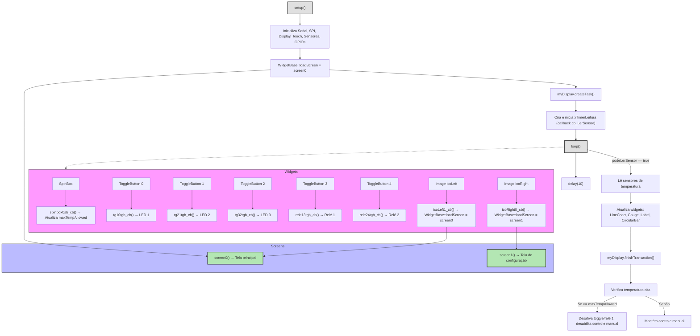

# Fluxo do Código `leitor_temperatura.ino`

Este diagrama mostra o fluxo principal do código, a interação dos widgets e a navegação entre telas.

## Legenda
- **setup()**: Inicialização de hardware, display, sensores e widgets.
- **loop()**: Leitura periódica dos sensores, atualização dos widgets e controle dos relés.
- **Widgets**: Callbacks dos botões, spinbox e imagens.
- **Screens**: Funções de desenho das telas principal e de configuração.
- **Navegação**: As imagens permitem alternar entre as telas. 